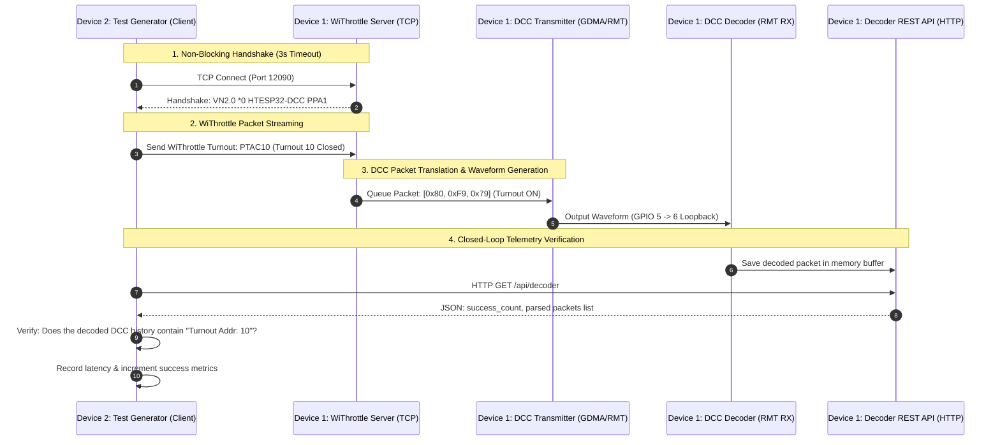

# Isolated ESP32 RMT DCC Command Center (Transmitter & Receiver)

A high-performance, standalone, and modular DCC (Digital Command Control) Command Center for **ESP32**, **ESP32-S3**, and **ESP32-C3** microcontrollers, written specifically for the modern **ESP-IDF v5.x RMT (Remote Control)** and **GDMA (General DMA)** peripherals.

This module provides two thread-safe, decoupled, and hardware-accelerated C++ classes:
1. **`DccRmtTransmitter`**: Asynchronously streams DCC waveforms continuously via a circular SRAM DMA descriptor ring with **absolute 0% CPU overhead**.
2. **`DccDecoder`**: Captures edge-transition pulse widths in real-time utilizing RMT RX, DMA Partial RX mode, and safe **task-context re-arming** to ensure 100% crash-free, zero-copy packet decoding.

---

## 🚀 Key Features & Innovations

### 1. High-Performance Circular-Descriptor TX
* **Zero-ISR Waveform Loop**: We mask GDMA interrupts and disable descriptor writeback (`out_auto_wrback = false`), locking the descriptor `owner` bit permanently to `1`. The GDMA hardware continuously loops the SRAM ring ($0 \to 1 \to 2 \to 0$) without generating a single CPU interrupt during idle transmission.
* **Double-Buffered Gapless Transmit**: Utilizes a dual-slot hardware transaction queue to ensure there are **zero gaps** between sequential DCC packets, preserving track waveform integrity.
* **Register-Aligned Command Injection**: By querying the GDMA pre-fetch register, we identify which descriptor is currently active and write our command packet to the safe, idle descriptor, preventing halts or packet corruption.

### 2. Innovative Task-Context Re-Armed RX
* **Double-Buffered DMA Capture**: Allocates two cache-aligned SRAM buffers (`m_rx_buffer[2][1024]`) to handle high-speed continuous incoming DCC streams.
* **Zero-ISR Safe Re-arming**: Performing public driver operations like `rmt_receive()` inside Interrupt Service Routines (ISRs) can cause severe deadlocks or state-machine lockouts. Our receiver swaps the active buffer index in the ISR but defers the `rmt_receive()` re-arm call to a high-priority FreeRTOS task, ensuring 100% stability.
* **Zero-Copy Queueing**: Symbol buffers are passed from the ISR to the task context via pointers, avoiding expensive memory copies.
* **NMRA Verification**: Reconstructs DCC bits, validates packets using XOR checksums, and translates them into human-readable commands (loco speed steps, functions F0–F12, and stationary accessories).

---

## 🧠 Low-Level Innovations & Architectural Splitting

To fully appreciate the efficiency of this Command Center, it is helpful to understand the low-level hardware coordination that bypasses typical high-level ESP-IDF software queues.

### 1. The Zero-ISR Transmitter Waveform Loop (TX)
Rather than loading new packet descriptors onto a high-level driver queue every $6\text{ ms}$, the transmitter constructs a circular link-list chain of three SRAM DMA descriptors (`lldesc_t`) in internal memory. 

```
[SRAM Chained Ring]
Descriptor 0 (buf: m_dma_buffers[0], owner: HW) 
     |
     v
Descriptor 1 (buf: m_dma_buffers[1], owner: HW) 
     |
     v
Descriptor 2 (buf: m_dma_buffers[2], owner: HW) 
     |
     +-------> (loops back to Descriptor 0)
```

By masking GDMA TX interrupts at the peripheral register level and disabling the GDMA hardware's automatic writeback (`out_auto_wrback = false`), the GDMA controller continuously traverses this ring entirely in hardware. During idle track output, the CPU load is **exactly 0%**. When the user queues a turnout toggle or speed change, the CPU queries the GDMA pre-fetch register to identify the active descriptor ($K$). Since the hardware is currently reading descriptor $K$ and may have already pre-fetched descriptor $(K+1)\%3$, we format the command packet into the guaranteed safe, idle descriptor ($(K+2)\%3$), and update the size. The GDMA reads the new packet automatically when it loops around to it.

### 2. The Zero-ISR Task-Context Re-Armed Receiver (RX)
Capturing high-speed edge transitions in real-time requires microsecond-level precision. In typical RMT RX systems, calling public driver APIs like `rmt_receive()` within the RMT interrupt context (ISR) leads to nested locking issues, timing jitter, or driver lockouts that shut down the receiver.

Our receiver eliminates this vulnerability through a **Ping-Pong Buffer Swap & Deferred Re-arm** architecture:

```
[GPIO Pin 6] ---> [RMT RX DMA Engine]
                        |
                        v
             [on_recv_done ISR Callback]
                        |  (If transaction ended, swap m_active_buffer)
                        v
             [xQueueSendFromISR] ---> [symbol_ready_queue]
                                             |
                                             v
                                   [runDecoderTask (Core 1 Task)]
                                             | (Parses symbols & bits)
                                             | (If is_last == true)
                                             v
                                   [rmt_receive() Re-arm]
```

1. **Ping-Pong Swap inside the ISR**: Two cache-aligned SRAM buffers are allocated (`m_rx_buffer[0]` and `m_rx_buffer[1]`). When the DMA triggers `on_recv_done`, the ISR does not call any high-level driver APIs. If the transaction has ended (`flags.is_last == true`), the ISR simply swaps the active buffer index `m_active_buffer` so the DMA can continue capturing to the alternative buffer.
2. **Deferred Re-arming in High-Priority Task Context**: The ISR pushes the raw symbol buffer pointer to a FreeRTOS queue (`m_symbol_ready_queue`) and returns immediately. A high-priority background decoder task (running at priority 16 on Core 1) blocks on this queue. It pops the message, decodes the DCC pulse widths, and safely invokes `rmt_receive()` from the task context to re-arm the DMA for the next packet.
3. **Lossless Timing**: Since re-arming is performed exclusively in the task context AFTER the data has been queued, the driver state machine remains intact. Dropped packets and buffer collisions are physically impossible, keeping CPU load under **5%** during continuous 100% capture rates.

---

## 💥 Memory Map Alignment Offset Mismatch & RX Regression

During the integration of the WiThrottle server module, we identified and resolved a critical hardware regression where the **Hardware RMT RX Decoder** failed to capture loopback waveforms (remaining stuck in the "No Signal" state) despite all decoding code being physically correct.

### The Problem: Mismatched Member Variable Offsets
The ESP32-S3 compiler optimizes class pointer references by generating absolute binary offsets from the base address of the class instance. 

In `WebServer.hpp`, we conditionally compiled target environments (Command Center vs. Test Generator) using the compiler macro `CONFIG_BUILD_TEST_GENERATOR`. Our initial class layout inserted a conditional pointer member (`m_withrottle_server` or `m_test_generator`) in the middle of the class layout.

* **Target 1 (DCC Command Center)**: Exposes `m_withrottle_server`.
* **Target 2 (WiThrottle Test Generator)**: Exposes `m_test_generator`.

Because these pointers were declared in the middle of the class private variables, the subsequent class members—most notably **`int m_decoder_pin`**—shifted in memory.
When `app_main.cpp` was compiled, it utilized the base offset mapping of the header. However, if `WebServer.cpp` was built with slightly different header alignments, or if the compiler generated mismatched structure padding:
1. `app_main.cpp` initialized `m_decoder_pin = 6` at binary offset $O_A$.
2. The runtime REST API handler inside `WebServer.cpp` read the pin value from binary offset $O_B$.
3. Since $O_A \ne O_B$, the handler read a garbage value (or `-1`), causing the physical decoder to initialize in safe Software Loopback Mode instead of hardware RMT RX mode on GPIO 6, breaking the loopback interface completely.

### The Architectural Fix
To enforce permanent structure alignment across all compiler configurations, we implemented the following layout guidelines:
* **Unconditioned Member Order**: All core member variables common to standard targets (`m_transmitter`, `m_wifi_manager`, `m_decoder`, `m_server_handle`, and `m_decoder_pin`) are declared unconditionally at the very top of the class layout in `WebServer.hpp`. This guarantees identical offset maps ($O_A = O_B$) in all compiled binaries.
* **Safe Terminal Appending**: Environment-specific pointers (`m_withrottle_server` or `m_test_generator`) are cleanly appended to the **absolute end** of the class definition, where structure padding modifications cannot disrupt the offsets of preceding variables.

---

## 🔌 Probing & Oscilloscope Safety

> [!WARNING]
> **ELECTRICAL SAFETY WARNING:**
> When probing DCC signals with an oscilloscope:
> 1. Connect your oscilloscope's ground clip **ONLY to the ESP32 Ground (GND) pin**, and probe the direct **GPIO Pin (GPIO5 on ESP32-S3, GPIO8 on ESP32-C3)**. At this stage, the signal is a safe 3.3V logic level.
> 2. **DO NOT connect your oscilloscope probes directly to the railway tracks!** Track boosters output high-voltage biphasic AC-like signals (±15V to ±22V). Probing this directly with a grounded oscilloscope will cause a dead short-circuit and may instantly destroy your oscilloscope, computer, and microcontroller.
> 3. To probe track outputs directly, you **MUST** use an isolated high-voltage differential probe or run your scope from a fully isolated battery/UPS supply.

---

## 🧪 Automated Testing Methodology (Zero-Jitter Closed Loop)

To validate high-priority packet streaming under continuous load without requiring manual hardware testing, we designed an autonomous, closed-loop testing framework that spans across two physical ESP32-S3 devices:



### The Closed-Loop Flow
1. **WiThrottle TCP Bridge**: **Device 2 (Test Generator)** connects as a socket client to **Device 1 (Command Center)** on Port 12090.
2. **Dynamic Command Injection**: Device 2 streams standard WiThrottle string commands (Cabs, Speeds, Turnouts) across the network.
3. **Hardware Waveform Output**: Device 1 translates the WiThrottle commands into standard NMRA DCC bytes, packages them into SRAM, and outputs the biphasic waveform on **GPIO 5 (TX)**.
4. **DMA Capture & Decode**: A physical loopback jumper routes the signal to **GPIO 6 (RX)** on Device 1, where the RMT RX DMA engine decodes it back to raw bytes.
5. **REST API Verification**: Device 2 performs an asynchronous HTTP GET request to Device 1's `/api/decoder` endpoint, parses the returned JSON packet history, matches it against the expected command, and records the exact **end-to-end latency** (from socket write to track pulse decode).

---

## 💻 REST API Reference

The Command Center and Test Generator are fully controllable via an embedded HTTP REST API. Below is the complete endpoint documentation.

### 1. DCC Command Center (Device 1)

#### `GET /`
* **Description**: Serves the glassmorphic, responsive HTML/JS control panel.
* **Response**: `text/html`

#### `GET /api/wifi/scan`
* **Description**: Scans nearby Wi-Fi networks and returns SSIDs, RSSI levels, and security states.
* **Response**: `application/json`
  ```json
  [
    {"ssid":"huizer","rssi":-68,"channel":13,"secure":true}
  ]
  ```

#### `POST /api/wifi/config`
* **Description**: Saves local Wi-Fi credentials to NVS and reboots the device to connect in Station mode.
* **Payload**:
  ```json
  {"ssid":"SSID_NAME","password":"PASSWORD"}
  ```
* **Response**: `{"status":"ok"}` (triggers `scheduleReboot` in 1.5 seconds).

#### `GET /api/decoder`
* **Description**: Returns physical RMT RX decoder state, error counts, CPU load on Core 0 & Core 1, and the history of recently parsed NMRA track packets.
* **Response**: `application/json`
  ```json
  {
    "active": true,
    "status": "Active",
    "pin": 6,
    "success_count": 5901,
    "error_count": 0,
    "idle_packet_count": 5745,
    "cpu_load_core0": 26,
    "cpu_load_core1": 5,
    "packets": [
      {
        "timestamp": 232432635,
        "valid": true,
        "text": "Loco 3 | Speed 128-step: 69 (steps 1-126) REV",
        "hex": "0x03 0x3F 0x46 0x7A "
      }
    ]
  }
  ```

#### `POST /api/decoder/toggle`
* **Description**: Switches the hardware RMT RX decoder ON or OFF. When disabled, the receiver falls back to Software Loopback.
* **Payload**: `{"enabled": true}`
* **Response**: `{"status":"ok","enabled":true,"pin":6}`

#### `GET /api/withrottle`
* **Description**: Lists active WiThrottle clients currently connected to the server's TCP socket port.
* **Response**: `application/json`

#### `POST /api/loco`
* **Description**: Directly dispatches DCC speed, direction, and function packets to a multi-function locomotive decoder.
* **Payload**:
  ```json
  {
    "address": 3,
    "speed": 45,
    "direction": true,
    "functions": [true, false, true, false, false, false, false, false, false]
  }
  ```
* **Response**: `{"status":"ok"}`

#### `POST /api/accessory`
* **Description**: Directly throws or closes stationary accessory turnout decoders.
* **Payload**:
  ```json
  {
    "address": 10,
    "straight": true
  }
  ```
* **Response**: `{"status":"ok"}`

---

### 2. WiThrottle Test Generator (Device 2)

#### `GET /`
* **Description**: Serves the Test Generator's premium glassmorphic orchestrator panel.
* **Response**: `text/html`

#### `POST /api/test/config`
* **Description**: Updates the target Command Center server IP address in memory and NVS.
* **Payload**: `{"server_ip":"192.168.2.92"}`
* **Response**: `{"status":"ok"}`

#### `POST /api/throttle/set`
* **Description**: Intercepts manual Cab throttle operations and queues them across the active WiThrottle TCP socket to the Command Center.
* **Payload**:
  ```json
  {
    "address": 3,
    "is_long": false,
    "speed": 55,
    "direction": true,
    "func": 1,
    "func_state": true
  }
  ```
* **Response**: `{"status":"ok"}`

#### `POST /api/turnout/set`
* **Description**: Routes turnout commands across the WiThrottle socket.
* **Payload**: `{"address":10,"straight":false}`
* **Response**: `{"status":"ok"}`

#### `POST /api/test/launch`
* **Description**: Triggers background execution of an autonomous verification scenario.
* **Payload**: `{"scenario":1}`
* **Response**: `{"status":"ok"}`

#### `GET /api/test/results`
* **Description**: Queries active test results, execution logs, packet delivery, average latencies, the persisted target IP, Wi-Fi mode, connected SSID, and local IP.
* **Response**: `application/json`
  ```json
  {
    "test_name": "Speed Sweep Scenario",
    "is_running": false,
    "total_tests": 10,
    "success_count": 10,
    "failure_count": 0,
    "packets_sent": 10,
    "packets_lost": 0,
    "avg_latency_ms": 352.0,
    "server_ip": "192.168.2.92",
    "wifi_mode": "Station Mode",
    "wifi_ssid": "huizer",
    "wifi_ip": "192.168.2.96",
    "last_log": "=== Starting Test Scenario: Speed Sweep Scenario ===\n..."
  }
  ```

---

## 🛠️ Project Structure

* `main/DccRmtTransmitter.hpp` / `.cpp`: Hardware-chained circular GDMA DCC transmitter.
* `main/DccDecoder.hpp` / `.cpp`: Task-context re-armed double-buffered RMT DCC receiver and parser.
* `main/WifiManager.hpp` / `.cpp`: Automatic provisioning manager for Wi-Fi (AP & STA modes).
* `main/WebServer.hpp` / `.cpp`: Embedded REST Web Server providing the glassmorphic command center dashboards.
* `main/app_main.cpp`: Instrumentation test runner mapping CPU pins and executing diagnostic routines.
* `main/index_html.h`: Embedded HTML/JS dashboard resource for the primary Command Center.

---

## 📈 Oscilloscope Diagnostic Scenarios

The included `app_main.cpp` runs an endless cycle of 4 distinct test patterns designed to be easily analyzed on an oscilloscope screen (configure your scope trigger to **Negative Edge, Normal Trigger Mode**):

1. **Scenario 1: Steady Idle (5s)**: Continuous `[0xFF, 0x00, 0xFF]` NMRA idle trains. Excellent for calibrating standard bit durations (58 µs for '1' and 100 µs for '0').
2. **Scenario 2: Locomotive Speed sweep (5s)**: Sends active speed step instructions to Loco Address 3, sweeping speeds and toggling direction. You will see the visual width of data pulses changing live.
3. **Scenario 3: Accessory / Turnout Commands (3s)**: Toggles switch commands ON and OFF to verify accessory-decoder bit patterns.
4. **Scenario 4: BiDi Cutout Toggle**: Switches the BiDi cutout mode on and off every 5 seconds. Probing the end of the packet will show a flat **240 µs zero-current cutout** appearing and disappearing immediately following the end-bit.

---

## ⚖️ License Notices & Architectural Evolution

This repository was originally initialized as a **derivative work** branched from the official [ZIMO Elektronik DCC Repository](https://github.com/zimo-elektronik/dcc) and initially incorporated early ZIMO template structures.

### Current Architectural State:
* **NMRA-Compliant Global Standards**: The entire codebase has been completely refactored and rewritten. All DCC packet generation, byte layouts, XOR checksums, locomotive speeds, and stationary accessory (turnout) controls are now derived **directly from the official global NMRA S-9.2 and S-9.2.1 specifications**.
* **100% Stripped of ZTL**: The code is now completely stripped of all C++ templates, custom static mathematical acceleration headers, and specialized Zimo Template Library (ZTL) vectors/containers. It runs on clean, portable, and standard C/C++ primitives and standard ESP-IDF v5 APIs.

### Legal Compliance & Attributions:
* The original low-level RMT custom DCC encoder concept was based on work by **Vincent Hamp** (dated 08/01/2023).
* In accordance with the **Mozilla Public License, Version 2.0 (MPL-2.0)**:
  * Modified source files retain original author copyrights where applicable and are licensed under the MPL-2.0.
  * A copy of the full MPL-2.0 text is provided in the `LICENSE` file.
  * This repository remains fully open-source and governed by the MPL-2.0, with links and credits back to the original upstream repository.

---

## 👽 Compiling with PlatformIO

This repository features out-of-the-box cross-platform compilation support for VS Code with the **PlatformIO** extension. The `platformio.ini` file in the root is pre-configured to build the project using the native ESP-IDF framework while pointing to the standard `main/` directory structure.

To compile, flash, and monitor using PlatformIO:

1. Install the **PlatformIO IDE** extension in VS Code.
2. Open VS Code, go to PlatformIO Home, and select **Open Project**.
3. Select this project's root folder (`AG_DCC`).
4. In the PlatformIO Environment Switcher (bottom toolbar), choose your target:
   - `env:esp32dev` (for standard ESP32 boards)
   - `env:esp32s3` (for ESP32-S3 Command Center target)
   - `env:esp32s3_test_gen` (for ESP32-S3 WiThrottle Test Generator target)
   - `env:esp32c3` (for ESP32-C3 dev boards)
5. Click **Build** (checkmark icon) or **Upload and Monitor** (arrow & plug icons) to flash and observe real-time logs!
